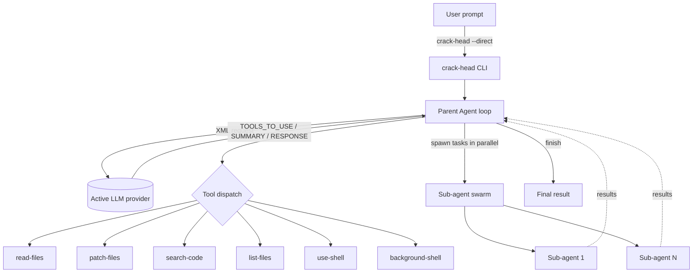

# crack-head

> A terminal-based AI coding agent that plans, searches, edits, and runs code across your project — powered by your choice of **12 LLM providers**, with parallel sub-agent swarms and long-running process management.

<p align="left">
  
  
  
  
  
</p>

## Quick start

Install the prebuilt binary — **no Node required** — with one command:

```bash
curl -fsSL https://raw.githubusercontent.com/abhinav-genx/crack-head/main/install.sh | sh
```

Then set a provider key and give it a task:

```bash
crack-head set-provider open-ai sk-your-key-here
crack-head --direct "Explain the architecture of this repository"
```

<sub>Windows or building from source? See [Installation](#installation).</sub>

---

## Table of Contents

- [Quick start](#quick-start)
- [Overview](#overview)
- [Features](#features)
- [Architecture](#architecture)
- [Requirements](#requirements)
- [Installation](#installation)
- [Configuration](#configuration)
- [Usage](#usage)
- [How It Works](#how-it-works)
- [Tools](#tools)
- [Project Structure](#project-structure)
- [Development](#development)
- [Security](#security)
- [Roadmap](#roadmap)
- [License](#license)

---

## Overview

**crack-head** is a command-line AI coding agent. You give it a natural-language task and it works autonomously in your repository: reading and searching files, applying patches, running shell commands, and even standing up long-lived dev servers to verify its work. When a task benefits from parallelism, the parent agent can spawn a **swarm of sub-agents** that each tackle a piece of the job concurrently.

The agent is model-agnostic. A single unified `chat()` interface fronts twelve providers, so you can switch between OpenAI, Anthropic, Gemini, Groq, DeepSeek, and more with one command.

## Features

- **12 LLM providers** behind one interface — swap models without touching code.
- **Autonomous agent loop** with summary-based memory, repetition guards, and a bounded iteration budget.
- **Parallel sub-agent swarms** — fan work out to multiple agents and collect their results.
- **Rich tool set** — read, patch, search, list, and run code (see [Tools](#tools)).
- **Background process manager** — start/stop/inspect long-lived processes (dev servers, watchers). Process state is persisted on disk, so a process started in one `--use-tools` call is still there to inspect or `stop` in the next; stop them explicitly when you're done.
- **XML tool protocol** — a strict, parseable request/response format that keeps smaller models on rails.
- **Persistent, secure config** — provider, model, and API keys stored locally at `~/.config/crack-head/config.json` with `0600` permissions.
- **One-shot mode** — pipe a prompt straight in with `--direct` for scripting and CI.

## Architecture



## Requirements

**Running the prebuilt binary** (recommended): none. The Node.js runtime is bundled into the executable — you only need a supported OS (macOS, Linux, or Windows) and an API key for at least one [provider](#supported-providers).

**Building from source / development:**

- **Node.js** ≥ 20 (the project is pure ESM)
- **pnpm** ≥ 11

### Quick install (recommended — no Node required)

Download a prebuilt, self-contained binary for your platform and put it on your `PATH`:

```bash
curl -fsSL https://raw.githubusercontent.com/abhinav-genx/crack-head/main/install.sh | sh
```

The script detects your OS/architecture, downloads the matching binary from the [latest release](https://github.com/abhinav-genx/crack-head/releases/latest), and installs it to `~/.local/bin`. Supported: macOS (Apple Silicon & Intel) and Linux (x64 & arm64).

Tune the install with environment variables:

| Variable                 | Default            | Purpose                                    |
| ------------------------ | ------------------ | ------------------------------------------ |
| `CRACK_HEAD_VERSION`     | `latest`           | Install a specific tag, e.g. `v1.2.0`.     |
| `CRACK_HEAD_INSTALL_DIR` | `$HOME/.local/bin` | Where to install the `crack-head` binary.  |

```bash
# Example: pin a version and install to /usr/local/bin
curl -fsSL https://raw.githubusercontent.com/abhinav-genx/crack-head/main/install.sh \
  | CRACK_HEAD_VERSION=v1.0.0 CRACK_HEAD_INSTALL_DIR=/usr/local/bin sh
```

**Windows:** download `crack-head-windows-x64.exe` from the [releases page](https://github.com/abhinav-genx/crack-head/releases/latest) and add it to your `PATH`.

Verify the install:

```bash
crack-head --help
```

To uninstall, delete the binary (e.g. `rm ~/.local/bin/crack-head`).

### From source (for development)

Requires Node.js ≥ 20 and pnpm ≥ 11.

```bash
# 1. Clone the repository
git clone https://github.com/abhinav-genx/crack-head.git
cd crack-head

# 2. Install dependencies
pnpm install

# 3. Build (compiles src/ → dist/)
pnpm build

# 4. Link the `crack-head` binary globally
pnpm link --global
```

> **Note:** After editing anything under `src/`, run `pnpm build` again so the global command picks up your changes.

## Configuration

Configuration lives in a single JSON file, resolved via the XDG spec:

```
$XDG_CONFIG_HOME/crack-head/config.json   # or ~/.config/crack-head/config.json
```

It stores your active `provider`, active `model`, and per-provider `apiKeys`. Because it holds secrets, the file is created with `0600` permissions. It is auto-initialized with sensible defaults on first run (`provider: open-router`, `model: gpt-4o-mini`).

Manage it entirely through the CLI:

```bash
# Set the active provider and store its API key in one step
crack-head set-provider open-ai sk-your-key-here

# Choose the model to run
crack-head set-model gpt-4o

# Remove a provider's stored key
crack-head remove-provider open-ai
```

### Supported Providers

Use the **slug** in the left column with `set-provider`.

| Slug           | Provider          |
| -------------- | ----------------- |
| `open-router`  | OpenRouter        |
| `open-ai`      | OpenAI            |
| `anathropic`   | Anthropic         |
| `gemini`       | Google Gemini     |
| `xai`          | xAI (Grok)        |
| `groq`         | Groq              |
| `mistral`      | Mistral AI        |
| `deepseek`     | DeepSeek          |
| `together`     | Together AI       |
| `fireworks`    | Fireworks AI      |
| `perplexity`   | Perplexity        |
| `cohere`       | Cohere            |

## Usage

### Quick start

```bash
# 1. Point crack-head at a provider + model
crack-head set-provider open-ai sk-your-key-here
crack-head set-model gpt-4o

# 2. Give it a task
crack-head --direct "Explain the architecture of this repository"
```

### Command reference

| Command                                | Description                                                  |
| -------------------------------------- | ----------------------------------------------------------- |
| `crack-head --direct <prompt>`         | Run a one-shot task and stream the result (alias: `-D`).    |
| `crack-head --use-tools <xml>`         | Execute tool XML directly, skipping the model (alias: `-t`). |
| `crack-head set-provider <slug> <key>` | Set the active provider and store its API key.              |
| `crack-head set-model <model>`         | Set the active model.                                       |
| `crack-head remove-provider <slug>`    | Delete a provider's stored API key.                         |
| `crack-head --version`                 | Print the version.                                          |
| `crack-head --help`                    | Show help and examples.                                     |

### Examples

```bash
# Ask a question about the codebase
crack-head --direct "Where is the agent loop defined and how does it terminate?"

# Have the agent implement and verify a change
crack-head --direct "Add a --json flag to the CLI and update the help text"

# Kick off a parallel build: multiple sub-agents working at once
crack-head --direct "Spawn two sub-agents: one scaffolds an Express API, the other a Vite React app"
```

Agent activity is streamed to your terminal, tagged by source:

```
[PARENT] : ...    # the top-level agent
[SWARM]  : ...    # sub-agents running in parallel
[SYSTEM] : ...    # lifecycle / status messages
```

### Running tools directly (`--use-tools`)

Execute one or more `<TOOL>` blocks straight away — bypassing the model entirely — and print the raw `<TOOL_OUTPUT>`. Handy for scripting, debugging tool parsers, or replaying a tool call the agent emitted.

The XML is the same format the agent produces inside `<TOOLS_TO_USE>`; you can pass either the bare `<TOOL>` blocks or a full `<TOOLS_TO_USE>` wrapper. Input can come from three sources:

| Value        | Source                        |
| ------------ | ----------------------------- |
| raw string   | literal XML passed on the CLI |
| `@path`      | read the XML from a file      |
| `-`          | read the XML from stdin       |

Because tool XML contains `<`, `>`, `!`, and `<![CDATA[ ... ]]>`, passing it as a raw shell argument is error-prone (in zsh, `!` triggers history expansion — `event not found`). **Prefer stdin or a file:**

```bash
# From stdin via a quoted heredoc (no shell expansion — the safest option)
crack-head --use-tools - <<'EOF'
<TOOL>
<NAME>patch-files</NAME>
<FILE>
<FILE_NAME>summary.txt</FILE_NAME>
<PATCH>
<OLD_STR><![CDATA[]]></OLD_STR>
<NEW_STR><![CDATA[Hello from crack-head!]]></NEW_STR>
</PATCH>
</FILE>
</TOOL>
EOF

# From a file
crack-head --use-tools @tools.xml

# As a single-quoted literal (use real newlines, not \n)
crack-head --use-tools '<TOOL><NAME>list-files</NAME></TOOL>'
```

Each executed tool prints a `<TOOL_OUTPUT>` block:

```xml
<TOOL_OUTPUT>
<TOOL_NAME>patch-files</TOOL_NAME>
<OUTPUT><![CDATA[
summary.txt: OK — created — 1 patch(es) applied
]]></OUTPUT>
</TOOL_OUTPUT>
```

> **State persists between calls.** Each `--use-tools` run is a separate process, but `background-shell` keeps its process registry and logs on disk (`~/.crack-head/bg`) — so you can `start` a server in one call and read its `logs` or `stop` it in a later one.

See [Tools](#tools) for the full list of tools and their XML schemas.

## How It Works

1. **Prompting** — Each agent is seeded with a system prompt describing the available tools and the strict XML protocol it must follow.
2. **The loop** — The parent agent iterates (bounded by a max-iteration budget). On each turn the model responds with XML blocks:
   - `<TOOLS_TO_USE>` — one or more tool calls to execute
   - `<SUMMARY>` — a running summary that serves as the agent's memory
   - `<RESPONSE>` — a message for the user
3. **Tool execution** — Requested tools are parsed and run; their outputs are wrapped and fed back into the next turn so the model can self-correct.
4. **Swarms** — When a task is parallelizable, the parent dispatches sub-agents (one per task) that run concurrently and stream their output back up.
5. **Finishing** — The agent calls the `finish` tool once it has verified its work, which breaks the loop and emits the final message. Repetition and loop guards prevent oscillation.

## Tools

Every tool is invoked through the XML protocol and owns its own parser.

| Tool               | Purpose                                                                        |
| ------------------ | ------------------------------------------------------------------------------ |
| `read-files`       | Read the contents of one or more files.                                        |
| `patch-files`      | Apply search/replace edits to files; creates missing parent directories, and an empty `OLD_STR` creates or overwrites the file.                     |
| `search-code`      | Regex ("grep"-style) search across the codebase.                               |
| `list-files`       | List files via glob patterns and render directory trees.                       |
| `use-shell`        | Run a non-interactive shell command with a timeout.                            |
| `background-shell` | Manage long-lived processes — `start`, `logs`, `list`, `stop`. State persists on disk (`~/.crack-head/bg`) so processes survive across separate CLI invocations; `stop` them explicitly. |
| `finish`           | Signal task completion with a final summary message.                           |

Shared filesystem helpers skip `node_modules`, `.git`, `dist`, and `build` when walking the tree.

## Project Structure

```
src/
├── cli.ts                  # CLI entry point (commander)
├── constants.ts            # PROVIDERS enum
├── prompts.ts              # System + task prompt builders
├── agent/
│   ├── parent.ts           # Parent agent + iteration loop
│   └── execute-agent-swarm.ts  # Parallel sub-agent orchestration
├── providers/              # One module per LLM provider + unified chat()
│   ├── index.ts            # chat(): resolves provider/model/key and dispatches
│   ├── openai-compatible.ts# Shared client for OpenAI-compatible APIs
│   └── ...                 # open-ai, anathropic, gemini, groq, ...
├── tools/                  # read-files, patch-files, use-shell, background-shell, ...
│   └── index.ts            # Tool registry + executeTools()
├── tui/
│   └── App.tsx             # Interactive TUI (planned — see Roadmap)
└── utils/
    ├── config.ts           # Provider/model/key resolution
    ├── config-store.ts     # Persisted config (~/.config/crack-head)
    ├── fs-search.ts        # glob + tree-walk helpers
    ├── xml-utils.ts        # XML extraction helpers
    └── errors.ts           # Error handling
```

## Development

```bash
# Run directly from source without building (via tsx)
pnpm dev --direct "your task here"

# Type-check and compile to dist/
pnpm build
```

| Script                | Action                                                        |
| --------------------- | ------------------------------------------------------------- |
| `pnpm dev`            | Run the CLI from source with `tsx`.                           |
| `pnpm build`          | Compile TypeScript to `dist/`.                                |
| `pnpm bundle`         | Bundle `dist/` into a single file with esbuild.               |
| `pnpm build:binaries` | Build standalone binaries for all platforms into `binaries/`. |

### Building standalone binaries

`pnpm build:binaries` compiles the app into self-contained executables (no Node required at runtime) for macOS, Linux, and Windows using [esbuild](https://esbuild.github.io/) + [@yao-pkg/pkg](https://github.com/yao-pkg/pkg). All targets cross-compile from a single machine, and the outputs land in `binaries/`. CI runs the same command on every `v*` tag (see [.github/workflows/release.yml](.github/workflows/release.yml)) and attaches the binaries to the GitHub Release that `install.sh` downloads from.

## Security

- API keys are stored **locally** in `~/.config/crack-head/config.json` with `0600` (owner read/write only) permissions and are never committed to the repository.
- The agent can execute shell commands and modify files in your working directory. Review the tasks you give it, and prefer running it inside a project directory you trust.

## Roadmap

- [ ] Interactive TUI (Ink) — dependencies are in place; `src/tui/App.tsx` is the entry point.
- [ ] Optional full conversation-history memory (in addition to summary memory).
- [ ] Additional providers and model presets.

## License

Released under the [MIT License](LICENSE). © 2026 abhinav-genx
